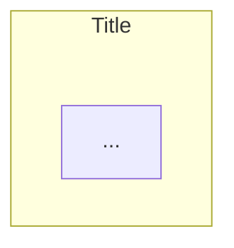
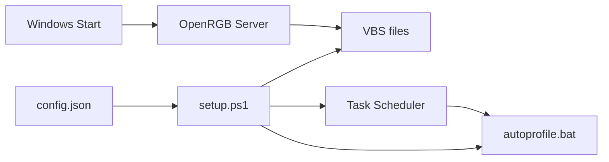
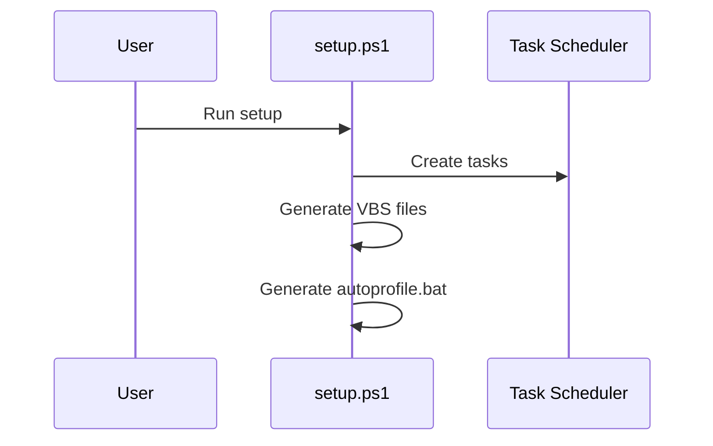

# CLAUDE.md

This file provides guidance to Claude Code (claude.ai/code) when working with code in this repository.

---

## PROJECT OVERVIEW

**PC Gadgets** is a collection of small automation tools and utilities for Windows.

**Project Hierarchy:**
```
PC Gadgets (Umbrella Project)
└── openRGB schedule (Current)
    - Automatic RGB profile switching based on time of day
    - Task Scheduler integration
    - VBS scripts for keyboard shortcuts
```

**Key Documentation:**
- [README.md](README.md) - Project overview, usage instructions, technical documentation

---

## MANDATORY WORKFLOW

**CRITICAL:** Follow this workflow for EVERY task.

### Before Starting Work - ASK QUESTIONS

Before writing ANY code or making ANY changes:

1. **Read the task carefully** - Understand what is being asked
2. **Identify ambiguities** - What is unclear? What could be interpreted multiple ways?
3. **Read relevant documentation** - Check README, comments in code
4. **Ask questions** - NEVER assume, ALWAYS verify:
   - "Should I modify existing file X or create new one?"
   - "You mentioned Y - did you mean Z or something else?"
   - "I see multiple approaches - which do you prefer?"
5. **Propose approach** - Explain HOW you will solve it
6. **Only after confirmation** → Start work

**Example:**
```
User: "Fix the config loading"

❌ WRONG: "I'll refactor the config code..." [starts coding immediately]

✅ CORRECT: "Before I start, let me clarify:
   1. Which file has the config loading issue?
   2. What specific behavior is wrong?
   3. Da li da proverim README dokumentaciju prvo?"
   [waits for answers]
```

---

## DEVELOPMENT RULES

### Rule #1: No Backward Compatibility

**When refactoring, update ALL callers. NEVER add "backward compatibility" wrappers!**

**Procedure:**
1. Search for ALL callers
2. Update EACH caller to use new API
3. Delete old method completely

---

### Rule #2: No Duplicate Code

**Always consider creating shared functions or modules.**

```
❌ FORBIDDEN - same logic in multiple files

✅ REQUIRED - shared module with reusable functions
```

**Before creating new file/function:** Check if similar functionality exists. Extend, don't duplicate.

---

### Rule #3: MD-First Development

**Documentation requirements:**

| Tip | Potrebna dokumentacija |
|-----|------------------------|
| Folder sa skriptama | `__index.md` u folderu |
| Skripta (.ps1, .py, .js) | Zaseban `.md` fajl pored skripte |
| Generisani fajlovi (.vbs, .bat) | NE treba - opisani u `__index.md` foldera |
| Config, slike, logovi | NE treba |

**File Structure Example:**
```
📁 project/
  📁 lib/
    📝 __index.md        ← Folder documentation
    🔧 init.ps1
    📝 init.md           ← Script documentation
    🔧 generate-bat.ps1
    📝 generate-bat.md   ← Script documentation
  📁 cycle/
    📝 __index.md        ← Folder docs (VBS files don't need individual .md)
    🔧 1-dawn.vbs
    🔧 2-morning.vbs
  📝 README.md           ← Main documentation
  📝 CLAUDE.md           ← AI assistant guidance
  ⚙️ config.json         ← Configuration (no .md needed)
```

**Folder `__index.md` structure:**
```markdown
# Folder Name

## Purpose
What this folder contains and why.

## Contents
List of files with brief descriptions.

## Usage
How files in this folder are used.
```

**Script `.md` structure:**
```markdown
# Script Name

**Script:** [Script Name (script)](script_name.ps1)

## Purpose
What this script does.

## Dependencies
What it needs to run.

## Functions / Sections
Description of main parts.
```

**Linking Rules:**
- Links ALWAYS go to `.md` file (not directly to script)
- **Link text must be human-readable, NEVER show file paths**

```markdown
# ❌ FORBIDDEN - paths visible to reader
[lib/init.ps1](lib/init.ps1)

# ✅ REQUIRED - human-readable text
[Init Script](init.md)
```

**Navigation requirement:**
- Iz README.md mora biti moguće doći do SVAKOG .md fajla u projektu
- README linkuje na folder `__index.md` fajlove
- Folder `__index.md` linkuje na pojedinačne script `.md` fajlove

```
README.md
  ↓
lib/__index.md → init.md, generate-bat.md, ...
cycle/__index.md
rainbow/__index.md
CLAUDE.md
```

**Before modifying existing file:**
1. Read its `.md` documentation
2. Consult if something is unclear
3. Update `.md` if changing functionality

---

### Rule #4: Constructive Disagreement (Obrazloženo Neslaganje)

**Ako znaš da korisnikov predlog nije optimalan, MORAŠ:**

1. **Objasniti ZAŠTO** - sa konkretnim tehničkim razlozima
2. **Predložiti alternativu** - ako postoji bolje rešenje
3. **Tražiti potvrdu** - tek nakon što korisnik razume trade-off

```
❌ ZABRANJENO - slepo prihvatanje
User: "Dodaj --client flag svuda"
Claude: "OK, implementiraću to."

✅ OBAVEZNO - obrazloženo neslaganje
User: "Dodaj --client flag svuda"
Claude: "Razmotrio sam to, ali vidim potencijalni problem:
- --client zahteva da server već radi
- Ako server nije pokrenut, skripta će tiho failovati
- Bez --client, OpenRGB se pokreće sam (sporije ali sigurnije)

Predlažem: Koristimo -p bez --client za pouzdanost.
Da li želiš da objasnim detaljnije?"
```

**Princip:** Bolje je kratkoročno usporiti rad diskusijom nego dugoročno implementirati neefikasno rešenje.

---

### Rule #5: Language Rules

**Conversation vs Code/Documentation:**

| Context | Language |
|---------|----------|
| Conversation with user | Serbian (Latin script) |
| Code comments | English |
| Documentation files (.md) | English |
| Variable/function names | English |

**Example:**
```
❌ WRONG
# Ovo je funkcija za ucitavanje configa
$putanjaDoFajla = "config.json"

✅ CORRECT
# Load configuration from JSON file
$configPath = "config.json"
```

---

### Rule #6: Plans are Discussions

**Plans should be discussions, not code previews.**

- Explain WHAT you will do and WHICH files you will modify
- Do NOT write out full code blocks that will later be copied to files
- The user will see the actual changes when you make them
- Plan = brainstorming, theorizing, approach discussion
- NOT: "I will write this exact code" → then write the same code again

---

## GUIDELINES

### Guideline #1: Verify Before Claiming

**Provide concrete evidence for ANY claim about completed work.**

```
❌ "I checked all files" → Must list specific files checked
❌ "I fixed the errors" → Must show exact changes made
✅ If unsure → ASK immediately
✅ If complex → Propose breaking into sub-tasks
```

---

### Guideline #2: No Version Suffixes

**Edit files directly - Git stores history!**

```
❌ FORBIDDEN
setup_v2.ps1
config_new.json
config_backup.json

✅ REQUIRED
setup.ps1  # Edit directly
```

---

### Guideline #3: Ask Before Deleting

**Before deleting ANY code:**
1. Search for all usages
2. Understand what it does
3. ASK if not found - don't assume it's obsolete

**Rule:** Better 100 questions than 1 deleted core feature.

---

## MARKDOWN GUIDELINES

### Hyperlinks with Explicit Anchors

**Problem:** GitHub, VSCode, GitLab generate anchors differently.

**Solution:** Always add `<a id="anchor-name"></a>` before headers in ToC.

```markdown
<a id="system-overview"></a>

## System Overview
```

**Anchor Naming:**
- Lowercase: `system-overview` not `System-Overview`
- Dashes for spaces: `data-flow` not `data_flow`
- No emoji in anchor: `overview` not `📊-overview`

---

### Table of Contents Rules

**Position:** Immediately after document title.

**What to include:**
- All `##` sections
- Important `###` subsections

```markdown
## Table of Contents

- [System Overview](#system-overview)
  - [Architecture](#architecture)
- [Configuration](#configuration)
```

---

### Folder Structure Notation

**Use emoji + indentation instead of ASCII box-drawing characters.**

ASCII tree (`├──`, `└──`, `│`) breaks on narrow screens and depends on monospace fonts.

**Emoji Legend:**

| Emoji | Use For |
|-------|---------|
| 📁 | Folder (closed) |
| 📂 | Folder (open/expanded) |
| 📄 | Generic file |
| 🔧 | Script file (.ps1, .bat, .vbs) |
| ⚙️ | Config file (.json, .env) |
| 📝 | Markdown / text file |
| 🖼️ | Image file |

**Example:**

```
❌ ASCII (breaks on mobile):
project/
├── src/
│   ├── main.ps1
│   └── utils.ps1
└── README.md

✅ Emoji (universal):
📁 project/
  📁 src/
    🔧 main.ps1
    🔧 utils.ps1
  📝 README.md
```

**Indentation:** 2 spaces per level.

---

### Diagrams with Mermaid

**Use Mermaid syntax instead of ASCII art diagrams.**

Mermaid renders as scalable graphics that adapt to screen size.

**Where Mermaid works:**

| Platform | Support |
|----------|---------|
| GitHub | ✅ |
| VS Code (preview) | ✅ |
| Obsidian | ✅ |

**Flowchart Directions:**
- `LR` = Left to Right
- `RL` = Right to Left
- `TB` = Top to Bottom
- `BT` = Bottom to Top

**Node Shapes:**

```
A[Rectangle]       - standard box
B(Rounded)         - rounded corners
C[(Database)]      - cylinder
D{Diamond}         - decision/condition
E((Circle))        - circle
F[[Subroutine]]    - double border
```

**Arrow Types:**

```
A --> B            - arrow
A --- B            - line (no arrow)
A -.- B            - dotted line
A ==> B            - thick arrow
A -- label --> B   - arrow with text
```

**Subgraph Title Spacing (REQUIRED):**

When using `subgraph`, titles can overlap with content below. Always add init config:



**Example - OpenRGB Schedule Flow:**



**Sequence Diagram:**



---

## REMEMBER ALWAYS

1. **ASK questions before work** - Never assume
2. **Propose approach, wait for confirmation** - Don't act on your own
3. **No Duplicate Code** - Reuse existing functions
4. **MD-First** - Read documentation before modifying any file
5. **Verify Dependencies** - Check what your change affects
6. **When Unsure → ASK** - Better 100 questions than 1 bug
7. **Plans are discussions** - Don't write code in plans
8. **Obrazloženo neslaganje** - Explain if you disagree, don't just comply
