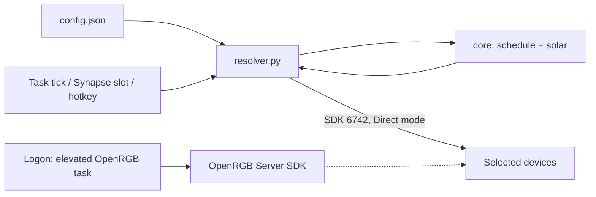

# CLAUDE.md — Ultra Vivid

The monorepo constitution governs: read the root `CLAUDE.md` first, then
load ONLY the rulebook your job needs via its Router. Nothing universal is
restated here — this file carries project FACTS and project DELTAS, and
may only tighten root rules, never loosen them.

| Your job this session | Read (monorepo root) |
|-----------------------|----------------------|
| Implement / fix | `rules/CODE.md` + the folder's `___folder.md` |
| Any GUI work | `rules/GUI.md` + `DESIGN.md` (incl. Zubi v2 algorithmic teeth — pending rollout, see below) |
| Write documentation | `rules/DOCS.md` |
| Build / release | `rules/SHIP.md` |
| Split a god-file | `REFACTOR-GODFILES.md` |
| Plan / brainstorm | `rules/PLAN.md` |

Start here for the code itself: [README](README.md) →
[Core (folder)](core/___core.md) / [GUI (folder)](gui/___gui.md). Open
decisions live in [Open Questions](OPEN-QUESTIONS.md).

---

## Project Facts

- **Product:** rule-based RGB scheduling. Color presets are applied to a
  user-selected subset of OpenRGB devices by ONE schedule grouping (hours /
  weekdays / monthdays / months / solar daylight) plus keyboard shortcuts.
  **Compute, don't generate** (Compute, Don't Generate — rules/CODE.md): no
  `.orp` profiles, no per-combination scripts — [Resolver](__about/resolver.md)
  computes the color for any moment.
- **Stack:** Python 3.13 (`openrgb-python` SDK client, `astral` solar math —
  same library/convention as DOMY Watch), four Task Scheduler tasks
  (`OpenRGB server`: log on, **elevated** `--server` — RAM SMBus needs admin;
  `Ultra Vivid resolver`: 10-min tick, cache-respecting; `Ultra Vivid wake`:
  log on + resume, `--force` — a power event resets the hardware, so the
  cache must not be trusted; `Ultra Vivid daemon`: resident, hotkeys +
  Chroma), PySide6 GUI (`python -m gui.app`).
  [Tasks](core/__about/tasks.md) also removes a conflicting auto-start
  `OpenRGB` *service* that otherwise owns the SMBus and blocks RAM writes
  at boot.
- **Config-driven:** everything lives in `config.json` schema v3 (THE CONFIG
  SECTION LAW — rules/CODE.md); [Settings](core/__about/settings.md) validates
  loudly and refuses old-schema configs.
- **Synapse boundary (researched 2026-07-22):** Razer Synapse bindings have
  NO automation API and Hypershift never reaches the OS — hence the stable
  `shortcuts/<SetName>/*.vbs` contract (bind LAUNCH once, re-map via
  config). Razer keyboard lighting IS programmable via the Chroma REST API
  (see [Chroma](core/__about/chroma.md)).

## Data Flow

```mermaid
flowchart LR
    A[config.json] --> R[resolver.py]
    T[Task tick / Synapse slot / hotkey] --> R
    R --> S[core: schedule + solar]
    S --> R
    R -->|SDK 6742, Direct mode| D[Selected devices]
    W[Logon: elevated OpenRGB task] --> O[OpenRGB Server SDK]
    O -.-> D
```

## Project Deltas to the Root Rules

- **Commit format uses a conventional-commit type:**
  `MAJOR.MINOR.NNN type(scope): description` (e.g.
  `0.1.351 docs(core): migrate to MD-First 2.0`). Patch is zero-padded to 3
  digits; increments by 1 for a same-session related commit and by more for
  unrelated work, per the root convention. The version lives in
  `version.py` (single source of truth, updated before committing, read by
  `setup/build.py`).
- **`setup/build.py` is the monorepo's REFERENCE implementation** of the
  Step-7 fail-closed verify gate (root `CLAUDE.md` → Build & Release
  System) — other projects copy this pattern; change it with extra care.
- Language: per root CLAUDE.md → Universal Conduct (Serbian/Latin in
  conversation, English in every file). No tightening beyond root here.

## Layout Teeth — pending migration (2026-08-06)

This project has a GUI and has NOT yet run the layout migration. Any GUI
work here follows [MIGRATE-LAYOUT.md](../../MIGRATE-LAYOUT.md) +
[GUI Rules](../../rules/GUI.md): the machine-wide layout guard already
bites in every session; what this project still owes is the per-project
audit — window registry, computed minimums fitting 1280x720, screenshots
opened and graded >= 8/10. Reference implementations: Remote User
(tests/test_layout_audit_qt.py) and DOMY Watch (tests/test_layout_audit.py).

GUI work here is also governed by Zubi v2 — Algorithmic Teeth & Grader v2
(../../rules/GUI.md#zubi-v2). No `layout_checks_qt.py`/`test_layout_audit_qt.py`
found in `tests/` — status here is **pending rollout**, same as the layout
migration above.
