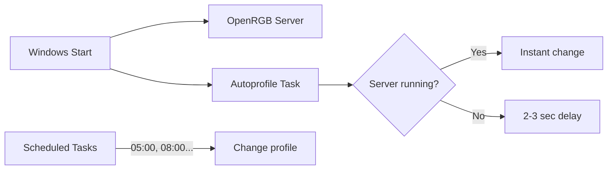
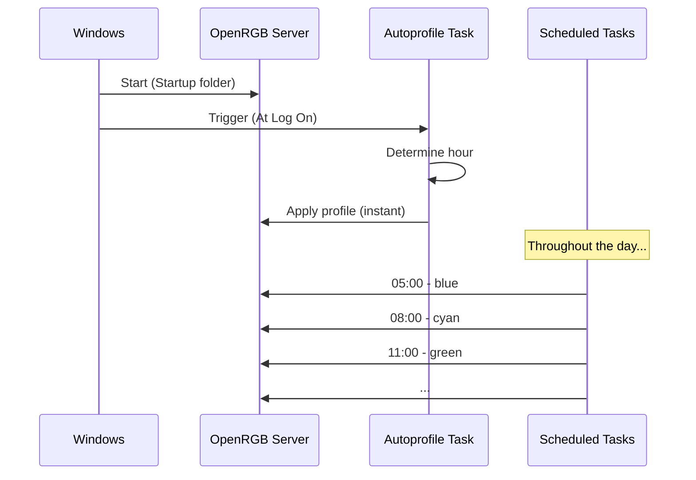

# 🌈 OpenRGB Schedule

Automatic RGB profile switching based on time of day.

## 📋 Table of Contents

- [How It Works](#how-it-works)
- [File Structure](#file-structure)
- [Getting Started](#getting-started)
- [Configuration](#configuration)
- [Troubleshooting](#troubleshooting)
- [Documentation](#documentation)

---

<a id="how-it-works"></a>

## ⚡ How It Works



**OpenRGB server** starts automatically with Windows (hidden, no window).

| Scenario | Speed |
|----------|-------|
| Server running | ⚡ Instant |
| Server not running | 🕐 2-3 sec delay |

---

<a id="file-structure"></a>

## 📁 File Structure

```
📁 openRGB schedule/
  ⚙️ config.json              ← THE ONLY FILE YOU EDIT
  🔧 setup.ps1                ← Run after changes
  📝 setup.md                 ← Documentation for setup.ps1
  📝 README.md
  📝 CLAUDE.md
  📁 generated/               ← Auto-generated VBS scripts
    📝 __index.md
    🔧 autoprofile.vbs
    🔧 autorainbow.vbs
  📁 lib/                     ← Helper scripts
    📝 __index.md
    🔧 init.ps1
    🔧 generate-bat.ps1
    🔧 generate-vbs.ps1
    🔧 create-tasks.ps1
  📁 cycle/                   ← Daily profiles + extras
    📝 __index.md
    🔧 *.vbs (auto-generated)
  📁 rainbow/                 ← Rainbow profiles
    📝 __index.md
    🔧 *.vbs (auto-generated)

📁 Windows Startup/
  🔧 OpenRGB-Server.vbs       ← Auto-generated
```

---

<a id="getting-started"></a>

## 🚀 Getting Started

### Setup Script

1. Right-click **Start** → **Terminal (Admin)**
2. Run:

```powershell
cd "U:\Coding\PC Gadgets\openRGB schedule"
Set-ExecutionPolicy Bypass -Scope Process
.\setup.ps1
```

### Generated Output

| Output | Location |
|--------|----------|
| Task Scheduler tasks | Windows Task Scheduler |
| autoprofile.vbs | `generated/` folder |
| autorainbow.vbs | `generated/` folder |
| Cycle VBS files | `cycle/` folder |
| Rainbow VBS files | `rainbow/` folder |
| OpenRGB-Server.vbs | Windows Startup folder |

---

<a id="configuration"></a>

## ⚙️ Configuration

### config.json Format

```json
{
    "openRGBPath": "C:\\Program Files\\OpenRGB\\OpenRGB.exe",
    "schedules": {
        "startHour": 5,
        "items": [
            { "taskName": "OpenRGB dawn", "vbsName": "1-dawn", "profile": "1-blue" },
            { "taskName": "OpenRGB morning", "vbsName": "2-morning", "profile": "2-cyan" }
        ]
    },
    "extras": [
        { "vbsName": "light", "profile": "9-white" }
    ],
    "rainbow": {
        "startHour": 0,
        "items": [
            { "vbsName": "F1", "profile": "UC-01-00F" }
        ]
    }
}
```

### Fields

| Field | Description | Example |
|-------|-------------|---------|
| `startHour` | Hour when the cycle begins | 5 (05:00) |
| `taskName` | Name in Task Scheduler | "OpenRGB dawn" |
| `vbsName` | VBS filename (without .vbs) | "1-dawn" |
| `profile` | Profile name in OpenRGB | "1-blue" |

### Auto-Calculated Times

Times are **automatically calculated** based on:
- `startHour` - hour when the cycle begins
- Number of profiles in the list

```
duration = 24 / number_of_profiles
time = (startHour + duration * index) % 24
```

**Example for 8 profiles with startHour=5:**
| Profile | Time |
|---------|------|
| 1-blue | 05:00 |
| 2-cyan | 08:00 |
| 3-green | 11:00 |
| ... | ... |
| 8-purple | 02:00 |

### Adding / Modifying Profiles

1. Create the profile in OpenRGB and save it
2. Edit `config.json` - add new item to the list
3. Run `.\setup.ps1` (as Admin)

---

<a id="troubleshooting"></a>

## 🔧 Troubleshooting

### "Connection attempt failed"

OpenRGB server is not running.

**Solution:** Check if `OpenRGB-Server.vbs` exists in Startup folder:
- `Win+R` → `shell:startup`

### Autoprofile shows wrong color

Run `generated/autoprofile.vbs` manually by double-clicking. The script uses `Hour(Now)` which is reliable across all Windows locales.

If still wrong, check your system clock settings.

### Server doesn't start on boot

1. Open `shell:startup`
2. Double-click `OpenRGB-Server.vbs`
3. Check if it works

---

<a id="documentation"></a>

## 📚 Documentation

### Main Documentation

| File | Description |
|------|-------------|
| [README.md](README.md) | This file - overview and instructions |
| [CLAUDE.md](CLAUDE.md) | AI assistant guidelines |
| [setup.md](setup.md) | Documentation for setup.ps1 |

### Folder Documentation

| Folder | Documentation | Description |
|--------|---------------|-------------|
| `generated/` | [generated/__index.md](generated/__index.md) | Auto-generated VBS scripts |
| `lib/` | [lib/__index.md](lib/__index.md) | Helper scripts for setup.ps1 |
| `cycle/` | [cycle/__index.md](cycle/__index.md) | VBS for daily profiles |
| `rainbow/` | [rainbow/__index.md](rainbow/__index.md) | VBS for rainbow profiles |

### Script Documentation

Detailed documentation for each script is in the `lib/` folder:

| Script | Documentation | Description |
|--------|---------------|-------------|
| init.ps1 | [init.md](lib/init.md) | Initialization, config, cleanup |
| generate-bat.ps1 | [generate-bat.md](lib/generate-bat.md) | VBS script generation (autoprofile, autorainbow) |
| generate-vbs.ps1 | [generate-vbs.md](lib/generate-vbs.md) | VBS file generation (cycle, rainbow) |
| create-tasks.ps1 | [create-tasks.md](lib/create-tasks.md) | Task Scheduler task creation |

---

## 🔄 Startup Flow


