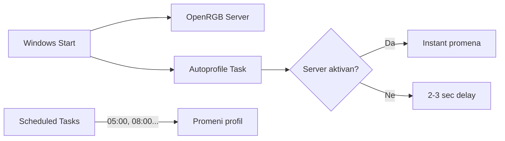
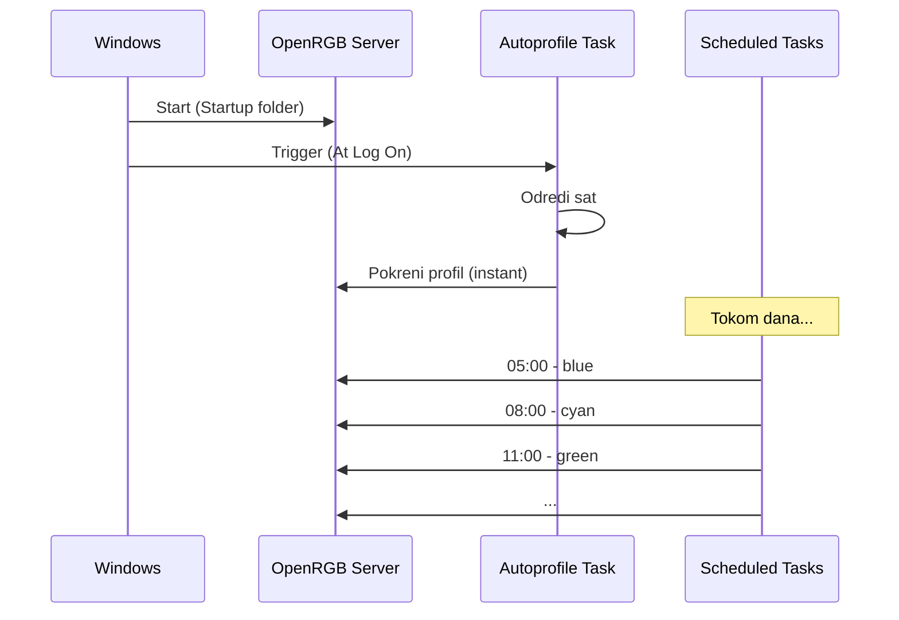

# 🌈 OpenRGB Schedule

Automatska promena RGB profila na osnovu vremena.

## 📋 Sadržaj

- [Kako radi](#kako-radi)
- [Struktura fajlova](#struktura-fajlova)
- [Pokretanje](#pokretanje)
- [Konfiguracija](#konfiguracija)
- [Troubleshooting](#troubleshooting)
- [Dokumentacija](#dokumentacija)

---

<a id="kako-radi"></a>

## ⚡ Kako radi



**OpenRGB server** se pokreće automatski pri startu Windows-a (u pozadini, bez prozora).

| Scenario | Brzina |
|----------|--------|
| Server aktivan | ⚡ Instant |
| Server nije aktivan | 🕐 2-3 sec delay |

---

<a id="struktura-fajlova"></a>

## 📁 Struktura fajlova

```
📁 openRGB schedule/
  ⚙️ config.json              ← JEDINI FAJL KOJI EDITIRAŠ
  🔧 setup.ps1                ← Pokreni nakon izmena
  📝 README.md
  📝 CLAUDE.md
  🔧 autoprofile.bat          ← Auto-generisan
  📁 lib/                     ← Helper skripte
    📝 __index.md
    🔧 init.ps1
    🔧 generate-bat.ps1
    🔧 generate-vbs.ps1
    🔧 create-tasks.ps1
  📁 cycle/                   ← Dnevni profili + extras
    📝 __index.md
    🔧 1-dawn.vbs ... 8-night.vbs
    🔧 light.vbs, dark.vbs
  📁 rainbow/                 ← Rainbow profili (F1-F12)
    📝 __index.md
    🔧 F1.vbs ... F12.vbs

📁 Windows Startup/
  🔧 OpenRGB-Server.vbs       ← Auto-generisan
```

---

<a id="pokretanje"></a>

## 🚀 Pokretanje

### Setup skripta

1. Desni klik na **Start** → **Terminal (Admin)**
2. Ukucaj:

```powershell
cd "U:\Coding\PC Gadgets\openRGB schedule"
Set-ExecutionPolicy Bypass -Scope Process
.\setup.ps1
```

### Šta generiše

| Output | Lokacija |
|--------|----------|
| Task Scheduler taskovi | Windows Task Scheduler |
| autoprofile.bat | Root folder |
| Cycle VBS fajlovi | `cycle/` folder |
| Rainbow VBS fajlovi | `rainbow/` folder |
| OpenRGB-Server.vbs | Windows Startup folder |

---

<a id="konfiguracija"></a>

## ⚙️ Konfiguracija

### config.json format

```json
{
    "openRGBPath": "C:\\Program Files\\OpenRGB\\OpenRGB.exe",
    "schedules": [
        {
            "taskName": "OpenRGB zora",
            "vbsName": "1-dawn",
            "time": "05:00",
            "profile": "1-blue",
            "hourStart": 5,
            "hourEnd": 8
        }
    ],
    "extras": [
        { "vbsName": "light", "profile": "9-white" }
    ],
    "rainbow": [
        { "vbsName": "F1", "profile": "UC-01-00F" }
    ]
}
```

### Polja

| Polje | Opis | Primer |
|-------|------|--------|
| `taskName` | Ime u Task Scheduler-u | "OpenRGB zora" |
| `vbsName` | Ime VBS fajla (bez .vbs) | "1-dawn" |
| `time` | Vreme dnevnog taska | "05:00" |
| `profile` | Ime profila u OpenRGB | "1-blue" |
| `hourStart` | Početak intervala (za autoprofile) | 5 |
| `hourEnd` | Kraj intervala (za autoprofile) | 8 |

### hourStart / hourEnd primeri

| Interval | Značenje |
|----------|----------|
| `5-8` | Normalno (05:00 - 08:00) |
| `0-3` | Počinje u ponoć (00:00 - 03:00) |
| `20-0` | Završava u ponoć (20:00 - 24:00) |
| `23-2` | Prelazi preko ponoći (23:00 - 02:00) |

### Dodavanje / izmena profila

1. Napravi profil u OpenRGB i sačuvaj ga
2. Edituj `config.json`
3. Pokreni `.\setup.ps1` (kao Admin)

---

<a id="troubleshooting"></a>

## 🔧 Troubleshooting

### "Connection attempt failed"

OpenRGB server nije pokrenut.

**Rešenje:** Proveri da li `OpenRGB-Server.vbs` postoji u Startup folderu:
- `Win+R` → `shell:startup`

### Autoprofile daje pogrešnu boju

Odkomentariši debug linije u `autoprofile.bat`:

```bat
echo SAT JE: %hour%
pause
```

### Server se ne pokreće pri startu

1. Otvori `shell:startup`
2. Double-click na `OpenRGB-Server.vbs`
3. Proveri da li radi

---

<a id="dokumentacija"></a>

## 📚 Dokumentacija

### Glavna dokumentacija

| Fajl | Opis |
|------|------|
| [README.md](README.md) | Ovaj fajl - pregled i uputstva |
| [CLAUDE.md](CLAUDE.md) | Smernice za AI asistenta |

### Folder dokumentacija

| Folder | Dokumentacija | Opis |
|--------|---------------|------|
| `lib/` | [lib/__index.md](lib/__index.md) | Helper skripte za setup.ps1 |
| `cycle/` | [cycle/__index.md](cycle/__index.md) | VBS za dnevne profile |
| `rainbow/` | [rainbow/__index.md](rainbow/__index.md) | VBS za rainbow profile |

### Script dokumentacija

Detaljna dokumentacija za svaku skriptu nalazi se u `lib/` folderu:

| Skripta | Dokumentacija | Opis |
|---------|---------------|------|
| init.ps1 | [init.md](lib/init.md) | Inicijalizacija, config, cleanup |
| generate-bat.ps1 | [generate-bat.md](lib/generate-bat.md) | Generisanje autoprofile.bat |
| generate-vbs.ps1 | [generate-vbs.md](lib/generate-vbs.md) | Generisanje VBS fajlova |
| create-tasks.ps1 | [create-tasks.md](lib/create-tasks.md) | Kreiranje Task Scheduler taskova |

---

## 🔄 Startup Flow


