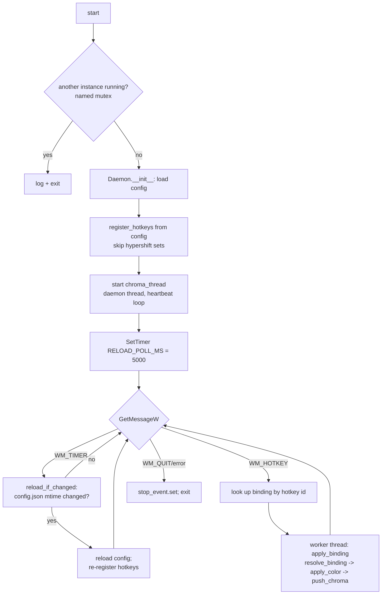

# Hotkey Daemon — Flow

**About:** [description](../__about/hotkey_daemon.md)

## Main loop



## Chroma thread (parallel, independent of the message loop)

```
chroma_thread():
    last_color = SENTINEL                      # forces first push
    LOOP every HEARTBEAT_SECONDS (~5s):
        IF chroma disabled:
            close session if open; continue
        TRY:
            IF no session -> open one; last_color = SENTINEL
            heartbeat()
            IF follow_schedule:
                color = schedule.resolve(cfg, now)
                IF color != last_color:
                    push_chroma(color); last_color = color
        ON ChromaError:
            log warning; drop session (retried next beat)
```

Both loops run concurrently: hotkey (un)registration and Win32 message
dispatch stay on the daemon's own thread (Win32 requirement — `RegisterHotKey`
is tied to the registering thread's message queue), while heartbeats and
schedule-following happen on the independent `chroma_thread`. A hotkey press
spawns its OWN short-lived worker thread so a slow SDK call never blocks the
message loop from picking up the next keypress.
