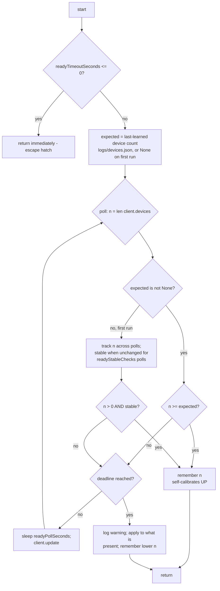

# Apply — Flow

**About:** [description](../__about/apply.md)

## Algorithm — `wait_until_ready`

The SDK server reports its socket as ready BEFORE device detection finishes,
so a slow device (typically RGB RAM) can be missing for a few seconds at log
on — the classic "everything got colored except the RAM". Fixed generically,
with NO hardware names in the code: the program learns how many devices this
machine has when everything is loaded, and waits for that count before
applying.



Pseudocode:

```
wait_until_ready(client, settings):
    IF readyTimeoutSeconds <= 0 -> return               # escape hatch
    expected = read learned count (logs/devices.json), or None
    deadline = now + readyTimeoutSeconds
    last_count, stable = -1, 0
    LOOP:
        n = len(client.devices)
        IF expected is not None:
            ready = n >= expected
        ELSE:                                            # first run ever
            IF n == last_count: stable += 1 ELSE: last_count, stable = n, 1
            ready = n > 0 AND stable >= readyStableChecks
        IF ready:
            remember(n)                                  # self-calibrates UP
            RETURN
        IF now >= deadline:
            WARN "device list still incomplete"
            remember(n)                                  # self-calibrates DOWN
            RETURN
        sleep(readyPollSeconds); client.update()
```

- **Warm machine** (shortcuts, 10-min tick, resume): the count is already
  met — returns on the first poll, zero added latency.
- **Cold boot with a slow device**: polls until it appears, THEN applies —
  until then the previous color stays on the hardware.
- The learned count lives in `logs/devices.json` (`paths.DEVICE_STATE_PATH`),
  owned solely by this module (separate from the resolver's `state.json`).
