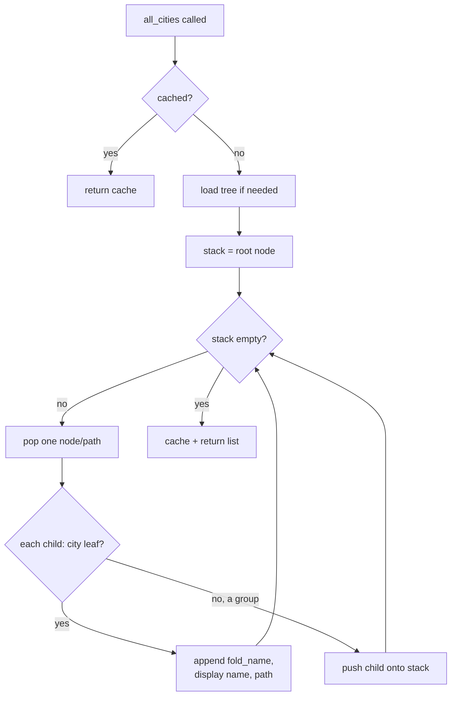

# World Locations — Flow

**About:** [description](../__about/locations.md)

## Tree shape

```
world_locations.json
📁 Continent
  📁 Subregion
    📁 Country
      📁 Admin            ← OPTIONAL level, only some countries have it
        🏙 City  {latitude, longitude, timezone}
      🏙 City              ← countries with no Admin level go straight to City
```

A dict value is a **city leaf** iff it has a `"latitude"` key
(`_is_city_leaf`) — never decided by nesting depth, which is why Admin can
be silently skipped.

## Algorithm — `all_cities()` (the live-search index)



Pseudocode:

```
all_cities():
    IF cached -> return cache
    load()
    stack = [(root_path=(), root_node)]
    cities = []
    WHILE stack not empty:
        node_path, node = stack.pop()
        FOR EACH child_name, value IN node.items():
            child_path = node_path + (child_name,)
            IF is_city_leaf(value):
                cities.append((fold_name(child_name), child_name, child_path))
            ELSE:
                stack.push((child_path, value))
    cache = cities; return cities

fold_name(text):
    # search folding: bundled names are ASCII transliterations, so native
    # spellings must match them ("Niš" finds "Nis")
    decomposed = NFKD-normalize(text)
    stripped = decomposed with combining marks removed
    RETURN apply single-codepoint TRANSLITERATIONS table, then casefold
```

`children(node_path)` is a simple one-level dict lookup that walks
`node_path` segment by segment and raises `KeyError` (with the offending
segment and depth named) on an unknown path — callers in
[Location Picker](../../gui/__about/location_picker.md) catch it and treat
it as "no children yet" during cascading rebuilds.
