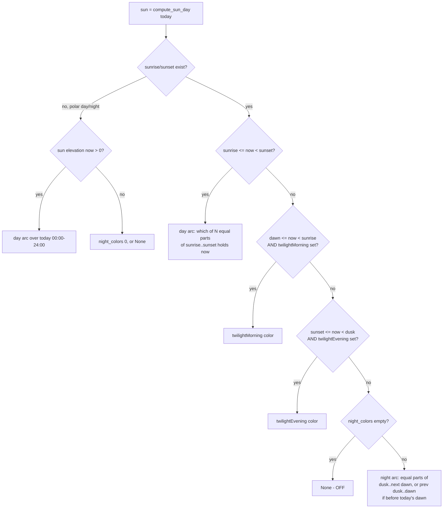

# Schedule — Flow

**About:** [description](../__about/schedule.md)

## Algorithm

```mermaid
%%{init: {'flowchart': {'subGraphTitleMargin': {'top': 0, 'bottom': 35}}}}%%
flowchart TB
    A[resolve settings, now] --> B{schedule_enabled?}
    B -- no --> OFF[return None - OFF]
    B -- yes --> C{active preset?}
    C -- none --> OFF
    C -- yes --> D{preset.type}
    D -- hours --> E[first slot covering now.hour<br/>to exclusive, may wrap midnight]
    D -- weekdays --> F[weekdays)[now.weekday]]
    D -- monthdays --> G[first from/to group<br/>covering now.day, inclusive]
    D -- months --> H[months)[now.month]]
    D -- daylight --> I[[daylight arc resolution]]
    E --> RESULT[color name or None]
    F --> RESULT
    G --> RESULT
    H --> RESULT
    I --> RESULT
```

### Daylight arc resolution (the `daylight` branch)



Pseudocode (language-neutral):

```
resolve(settings, now):
    IF NOT settings.schedule_enabled -> None
    preset = settings.active()
    IF preset is None -> None
    SWITCH preset.type:
        hours:     first slot where from <= hour < to (wrap-aware) -> color, else None
        weekdays:  weekdays[weekday(now)]                          -> color (always present)
        monthdays: first from/to group (inclusive) containing now.day -> color, else None
        months:    months[month(now)]                              -> color (always present)
        daylight:  see below

daylight(settings, preset, now):
    sun = compute_sun_day(location, now.date)
    IF sun.sunrise is None OR sun.sunset is None:       # polar edge day
        IF sun_elevation(now) > 0 -> day arc over [midnight, midnight+1day)
        ELSE -> night_colors[0] or None
    ELSE IF sunrise <= now < sunset:
        -> day_colors[ index_in_arc(sunrise, sunset, now, len(day_colors)) ]
    ELSE IF dawn <= now < sunrise AND twilightMorning set:
        -> twilightMorning
    ELSE IF sunset <= now < dusk AND twilightEvening set:
        -> twilightEvening
    ELSE:                                                # night
        IF night_colors empty -> None
        start, end = today's dusk .. tomorrow's dawn   (or yesterday's dusk .. today's
                     dawn, when now is in the small hours before today's dawn)
        -> night_colors[ index_in_arc(start, end, now, len(night_colors)) ]

index_in_arc(start, end, now, count):
    -> which of `count` EQUAL sub-arcs of [start, end) contains `now`
       (equal split of the true sunrise->sunset interval is centered on
       solar noon BY DEFINITION — no separate "noon" logic needed)
```
