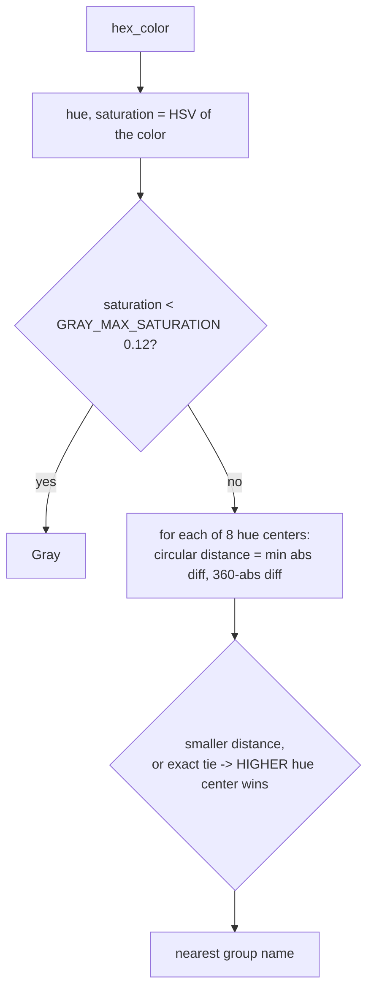

# Color Groups — Flow

**About:** [description](../__about/color_groups.md)

## Algorithm



Pseudocode:

```
group_of(hex_color):
    hue, saturation = HSV(hex_color)
    IF saturation < GRAY_MAX_SATURATION -> return "Gray"
    best = (Gray, distance=360, centre=-1)
    FOR EACH (name, centre) IN HUE_CENTERS:            # Red 0, Yellow 60,
                                                        # Green 120, Cyan 180,
                                                        # Azure 210, Blue 240,
                                                        # Magenta 300
        distance = |hue - centre|; distance = min(distance, 360 - distance)
        IF distance < best.distance
           OR (distance == best.distance AND centre > best.centre):
            best = (name, distance, centre)
    RETURN best.name
```

**The tie rule is not cosmetic:** violets sit on the Blue/Magenta boundary
(`#3C0078` is exactly 270°, `#8000FF` is 270.1°), so "first center wins"
would scatter two neighboring purples into two different groups — the
higher-hue tiebreak keeps them together (both land in Magenta).

`grouped(colors)` walks `GROUP_ORDER` (the owner's display order: R, G, B,
C, M, Y, O, A, then Gray) and buckets every color name by `group_of(first
hex value)`, dropping empty groups and preserving each color's original
config order within its group.
