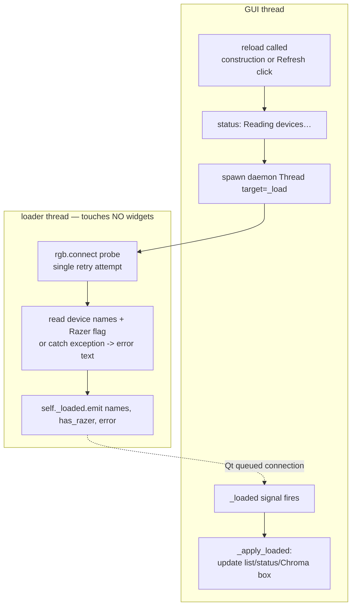

# Devices Tab — Flow

**About:** [description](../__about/devices_tab.md)

## Background load / signal handoff



Pseudocode:

```
reload():
    IF already loading -> return                       # no overlapping probes
    cfg = parse(raw)                                    # invalid config = no probe
    probe = cfg with connect_retries = 1                # live probe, not the
                                                          # resolver's startup wait
    status = "Reading devices…"; spawn Thread(_load, probe)

_load(probe):                                            # WORKER THREAD
    TRY:
        client = connect(probe)
        names = [d.name for d in client.devices]
        has_razer = any(is_razer_keyboard(d))
        emit _loaded(names, has_razer, "")
    EXCEPT Exception as e:
        emit _loaded([], False, str(e))                 # error text, not a crash

_apply_loaded(names, has_razer, error):                  # GUI THREAD (Qt queues
                                                          # the signal delivery)
    IF error:
        keep the list already on screen; show the error + the stored filter
        RETURN                                           # never blanks the page
    show/hide Chroma section by (has_razer OR already enabled)
    rebuild device_list from names, checked = NOT excluded by stored filter
```

The `_loaded` signal is the ONLY channel between the two threads — the
worker never touches a `QWidget` directly, which is what makes the "last
known list stays on screen on failure" guarantee safe (Qt widgets are not
thread-safe).
