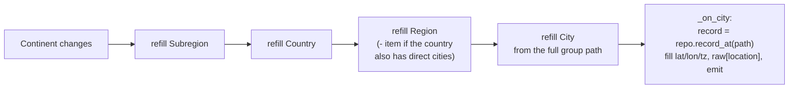

# Location Picker — Flow

**About:** [description](../__about/location_picker.md)

## Cascading combo dependency



Each level's `currentTextChanged` calls `_on_level(N)`, which refills every
combo from N downward (`_on_level(1)` refills Subregion, Country, Region AND
City; `_on_level(3)` only Region and City) — so a change at any level always
cascades forward, never leaves a stale child selection.

## Two ways to reach a city: cascade vs. search vs. restore

```
_filter_cities(text):                     # live search
    IF len(text) < 2 -> hide results
    wanted = fold_name(text)
    matches = [(display, path) for (folded, display, path) in repo.all_cities()
               if wanted in folded]
    sort: names STARTING WITH wanted first, then alphabetical
    show top _MAX_RESULTS as clickable rows

_pick_result(item) / _restore_stored():   # both delegate to:
_walk_to(path):
    for combo, segment in zip([continent, subregion, country], path[:3]):
        select segment in combo (index<0 -> abort silently: unknown path)
    IF path has an Admin level (len(tail)==2) -> select it in Region
    select path[-1] in City                  # triggers _on_city -> fills lat/lon/tz
```

`_restore_stored()` runs once at construction: it shows the raw lat/lon/tz
immediately (so the fields are never blank while the tree loads), THEN
finds the matching city by folded-name equality in `all_cities()` and
`_walk_to()`s the combos to it — reusing the exact same cascade the user's
own clicks would trigger.
