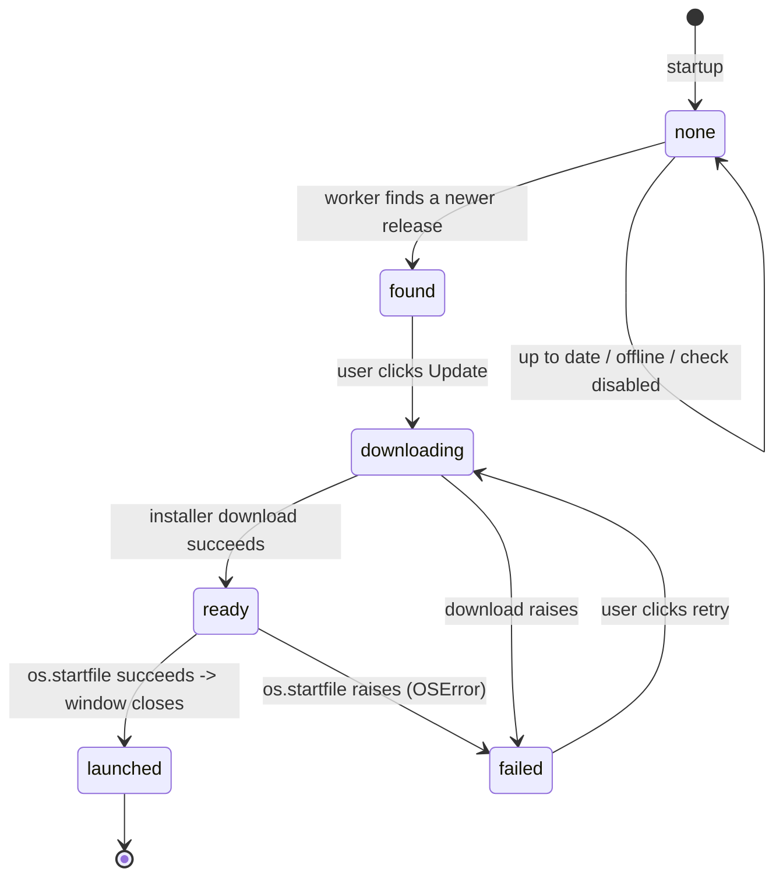

# Main Window — Flow

**About:** [description](../__about/main_window.md)

## Update-button state machine

Startup spawns a worker thread (`_check_updates`) that sets `self._update`
/ `self._update_state` once; a `QTimer` (1500 ms) on the GUI thread reads
those attributes and drives the button — the ONLY place Qt widgets are
touched, keeping the network call off the UI thread without a Qt signal.



`_refresh_update_button()` (the timer tick) is a plain state → label/enabled
mapping: `found` → "Update to vX" (enabled), `downloading` → "Downloading…"
(disabled), `ready` → launch the installer via `os.startfile` (ShellExecute,
triggers the installer's own UAC prompt) then close the window, `failed` →
"Update failed — retry" (enabled). States `None` and `launched` are no-ops
(nothing left to show / already handed off).

## Status-line refresh (independent timer, every 30 s)

```
_refresh_status():
    TRY: cfg = parse(raw); color = schedule.resolve(cfg, now)
         show "Active preset: X  ->  right now: color-or-OFF"
    ON ConfigError: show "Config incomplete: <error>"
    ON any other Exception: show the error text     # never let the status
                                                      # line crash the GUI
```
