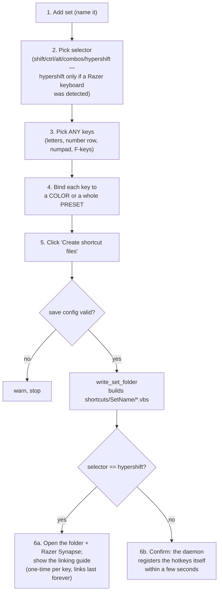

# Shortcuts Tab — Flow

**About:** [description](../__about/shortcuts_tab.md)

## The owner's flow, end to end

`_selector_choices()` only OFFERS `hypershift` when
`hypershift_available` (detected once at [Main Window](../__about/main_window.md)
construction via `core.apply.detect_hypershift_keyboard`) — or when the
CURRENT selector already is `hypershift` (so an existing hypershift set
never silently loses its selector if the keyboard is briefly unreachable).
