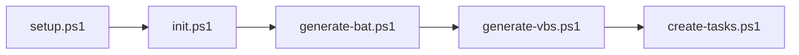

# lib/

Helper skripte za setup.ps1.

## Purpose

Ovaj folder sadrži modularne PowerShell skripte koje `setup.ps1` poziva redom. Svaka skripta radi jednu stvar, što olakšava održavanje i debugging.

## Contents

| Fajl | Dokumentacija | Opis |
|------|---------------|------|
| init.ps1 | [init.md](init.md) | Inicijalizacija - config, folderi, cleanup |
| generate-bat.ps1 | [generate-bat.md](generate-bat.md) | Generiše autoprofile.bat |
| generate-vbs.ps1 | [generate-vbs.md](generate-vbs.md) | Generiše sve VBS fajlove |
| create-tasks.ps1 | [create-tasks.md](create-tasks.md) | Kreira Task Scheduler taskove |

## Execution Order



## Shared Variables

`init.ps1` definiše globalne promenljive koje koriste sve ostale skripte:

| Promenljiva | Opis |
|-------------|------|
| `$scriptDir` | Root folder projekta |
| `$configPath` | Putanja do config.json |
| `$config` | Učitan JSON config |
| `$openRGBPath` | Putanja do OpenRGB.exe |
| `$autoprofilePath` | Putanja do autoprofile.bat |
| `$cyclePath` | Putanja do cycle/ foldera |
| `$rainbowPath` | Putanja do rainbow/ foldera |

## Usage

Ove skripte se NE pokreću direktno - poziva ih `setup.ps1` koristeći dot-sourcing:

```powershell
. (Join-Path $libPath "init.ps1")
```
