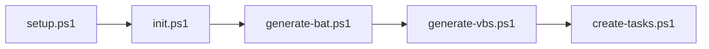

# lib/

Helper scripts for setup.ps1.

## Purpose

This folder contains modular PowerShell scripts that `setup.ps1` calls in sequence. Each script does one thing, making maintenance and debugging easier.

## Contents

| File | Documentation | Description |
|------|---------------|-------------|
| init.ps1 | [init.md](init.md) | Initialization - config, folders, cleanup |
| generate-bat.ps1 | [generate-bat.md](generate-bat.md) | Generates autoprofile.bat and autorainbow.bat |
| generate-vbs.ps1 | [generate-vbs.md](generate-vbs.md) | Generates all VBS files |
| create-tasks.ps1 | [create-tasks.md](create-tasks.md) | Creates Task Scheduler tasks |

## Execution Order



## Shared Variables

`init.ps1` defines global variables used by all other scripts:

| Variable | Description |
|----------|-------------|
| `$scriptDir` | Project root folder |
| `$configPath` | Path to config.json |
| `$config` | Loaded JSON config |
| `$openRGBPath` | Path to OpenRGB.exe |
| `$generatedPath` | Path to generated/ folder |
| `$autoprofilePath` | Path to generated/autoprofile.bat |
| `$autorainbowPath` | Path to generated/autorainbow.bat |
| `$cyclePath` | Path to cycle/ folder |
| `$rainbowPath` | Path to rainbow/ folder |

## Usage

These scripts are NOT run directly - `setup.ps1` calls them using dot-sourcing:

```powershell
. (Join-Path $libPath "init.ps1")
```
