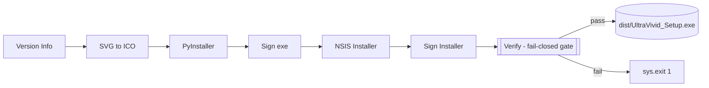

# Build — Flow

**About:** [description](../__about/build.md)

## Pipeline



## `verify_build()` — why it exists and what it checks

Every prior step fails SILENTLY: PyInstaller without `--version-file` still
builds an exe, just with an empty `CompanyName`; a skipped installer signing
just yields an unsigned file. The build would return exit 0 and *look* done
while shipping a broken artifact — this step reads the OUTPUT back instead
of trusting that the RECIPE ran.

```
verify_build(exe, installer):
    info = PowerShell (Get-Item exe).VersionInfo
    IF info.CompanyName != company.json["company_name"]:
        FAIL "CompanyName missing/wrong (version resource didn't run)"
    IF version.py's version NOT IN info.FileVersion:
        FAIL "FileVersion missing the project version"
    IF a signing cert IS configured (cert file + password exist):
        FOR EACH of (exe, installer):
            status = PowerShell (Get-AuthenticodeSignature target).Status
            IF status in ("", "NotSigned"):
                FAIL "<target> is NOT signed"
        # self-signed status is never "Valid" — only NotSigned/empty fails
    IF any FAIL -> print all, sys.exit(1)
    ELSE -> print OK summary (and "signing skipped" note if no cert)
```

Signing asserts are skipped ONLY when signing itself is the documented-
optional path (no cert configured) — everything else in this gate is
mandatory, every build, no exceptions.
